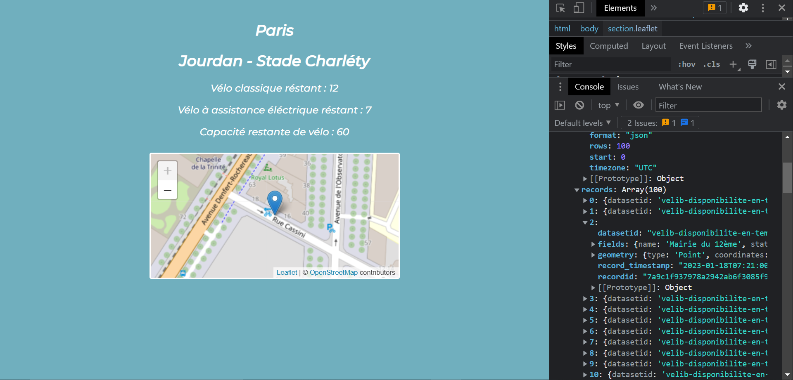

## Petit exercice Javascript 
 
- Mission : trouver un Velib disponible depuis chez toi  

La page html affiche un arrêt de Velib mis a jour en temps réel ( toutes les 10 secondes) grâce à l'API qu'utilise Velib, il y a aussi une map Leaflet qui affiche la station avec les coordonnées GPS de la dite station.

    

 Ciao 	&#129302;

